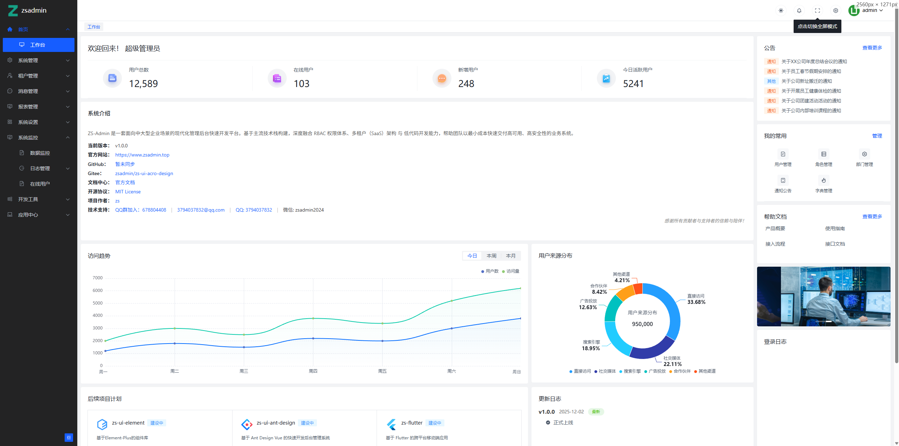

  
  <h1>ZS-Admin</h1>
  
🚀 企业级前后端分离快速开发平台 · 开箱即用 · 安全 · 可扩展

  

    <a href="https://www.zsadmin.top" target="_blank">官网</a> •
    <a href="https://www.zsadmin.top" target="_blank">文档</a> •
    <a href="http://demo.zsadmin.top" target="_blank">在线演示</a> •
    <a href="https://gitee.com/zs-admin/zs-admin-java" target="_blank">后端源码</a> •
    <a href="https://gitee.com/zs-admin/zs-ui-acro-design" target="_blank">前端源码</a>
  

## 🌟 项目简介

**ZS-Admin** 是一套面向中大型企业场景的现代化管理后台快速开发平台。基于主流技术栈构建，深度融合 **RBAC 权限体系**、**多租户（SaaS）架构** 与 **低代码开发能力**，帮助团队以最小成本快速交付高可用、高安全性的业务系统。

> 💡 适用于：OA 系统、ERP 后台、B2B 平台、SaaS 应用、内部管理系统等。

### ✨ 核心价值

- **极速启动**：初始化即具备完整权限与组织架构，5 分钟进入业务开发
- **降低重复劳动**：内置用户、角色、菜单、字典、日志等通用模块
- **架构清晰**：前后端完全解耦，模块化设计，便于二次开发与维护
- **生产就绪**：支持 Docker 部署、JWT 认证、SQL 监控、操作审计等企业级特性

## 🔗 官方资源

| 资源类型        | 地址                                               |
| --------------- | -------------------------------------------------- |
| 🌐 **官方网站** | [https://www.zsadmin.top](https://www.zsadmin.top) |
| 📚 **官方文档** | [https://www.zsadmin.top](https://www.zsadmin.top) |
| 🖥️ **在线演示** | [http://demo.zsadmin.top](http://demo.zsadmin.top) |
| 👤 演示账号     | `admin / 123456`（请勿修改关键配置）               |

## 

## ⚙️ 技术栈

| 层级     | 技术选型                                                                |
| -------- | ----------------------------------------------------------------------- |
| **后端** | JDK 17 · Spring Boot 3.x · Spring Security · MyBatis-Plus · JWT · Druid |
| **前端** | Vue 3 · Vite · Pinia · Arco Design Vue · TypeScript                     |
| **部署** | 支持 Docker 容器化                                                      |

## 🗂️ 源码仓库

| 平台      | 前端                                                              | 后端                                                      |
| --------- | ----------------------------------------------------------------- | --------------------------------------------------------- |
| **Gitee** | [zs-ui-acro-design](https://gitee.com/zs-admin/zs-ui-acro-design) | [zs-admin-java](https://gitee.com/zs-admin/zs-admin-java) |
| GitHub    | _暂未同步_                                                        | _暂未同步_                                                |

> ⭐ 欢迎 Star、Fork 与 PR！您的支持是我们持续迭代的动力！

## 🧩 功能全景

### 🏠 首页

- **工作台**：聚合待办、快捷入口、数据卡片，打造个性化操作中心。

### ⚙️ 系统管理

- **用户/部门/岗位**：完整的组织人事模型，支持树形结构与多对多关联。
- **角色 & 菜单**：基于 RBAC 的细粒度权限控制（菜单 + 按钮级）。
- **字典管理**：统一维护枚举值，前端自动映射下拉选项。
- **通知公告**：富文本编辑 + 定时发布 + 已读追踪。

### 🏢 租户管理（SaaS）

- **租户管理**：独立租户生命周期管理（启用/停用/过期）。
- **租户套餐**：定义功能包、数据配额、API 调用限制等。

### 📬 消息中心

- **站内信**：实时消息推送，支持批量操作与状态标记。
- **短信模板**：标准化模板管理，无缝对接阿里云、腾讯云等短信服务。

### 📊 报表管理

- **积木报表**：集成 [JimuReport](https://jimureport.com/)，拖拽式设计复杂报表，支持 Excel/PDF 导出。

### 🔧 系统设置

- **全局配置**：动态修改系统 Logo、名称、备案信息、第三方服务密钥等。
- **定时任务**：Cron 表达式配置、启停控制、执行日志查看。

### 📈 系统监控

- **SQL 监控**：Druid 集成，实时分析慢查询与连接池状态。
- **操作日志**：记录关键行为（增删改），支持按用户、IP、时间回溯。
- **在线用户**：实时列表（IP、终端、登录时间）。

### 🛠️ 开发工具

- **API 文档**：Swagger + Knife4j，自动生成 RESTful 接口文档，支持在线调试。
- **代码生成器**：输入表名 → 一键生成前后端 CRUD 代码（含 Vue 页面、Service、Controller 等）。

## 🌈 项目亮点

| 特性              | 说明                                              |
| ----------------- | ------------------------------------------------- |
| ✅ **开箱即用**   | 初始化数据库即可运行完整后台，无需从零搭建        |
| ✅ **企业级安全** | JWT 无状态认证 + Spring Security + 权限校验拦截器 |
| ✅ **多租户支持** | 数据隔离（Schema/字段级）、租户上下文自动注入     |
| ✅ **开发者友好** | 内置代码生成、接口调试、日志追踪三大提效利器      |
| ✅ **现代化 UI**  | 基于 Arco Design Vue，简洁美观，响应式布局        |
| ✅ **易于扩展**   | 模块化结构，新增业务模块只需关注核心逻辑          |

## 🤝 参与共建

- 🐞 **反馈问题**：[提交 Issue](https://gitee.com/zs-admin/zs-ui-acro-design/issues)
- 💡 **贡献代码**：欢迎 Fork 并提交 PR，共同完善 ZS-Admin！
- 💬 **加入社区**：关注官网底部获取 **官方 QQ 群 / 微信公众号** 入口
